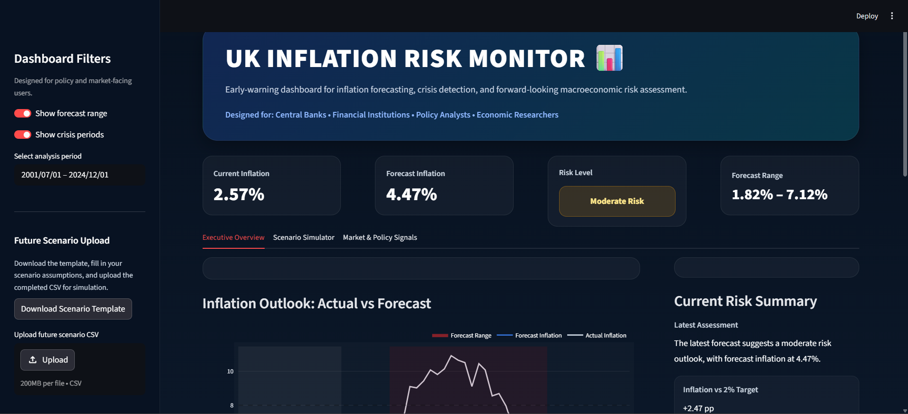
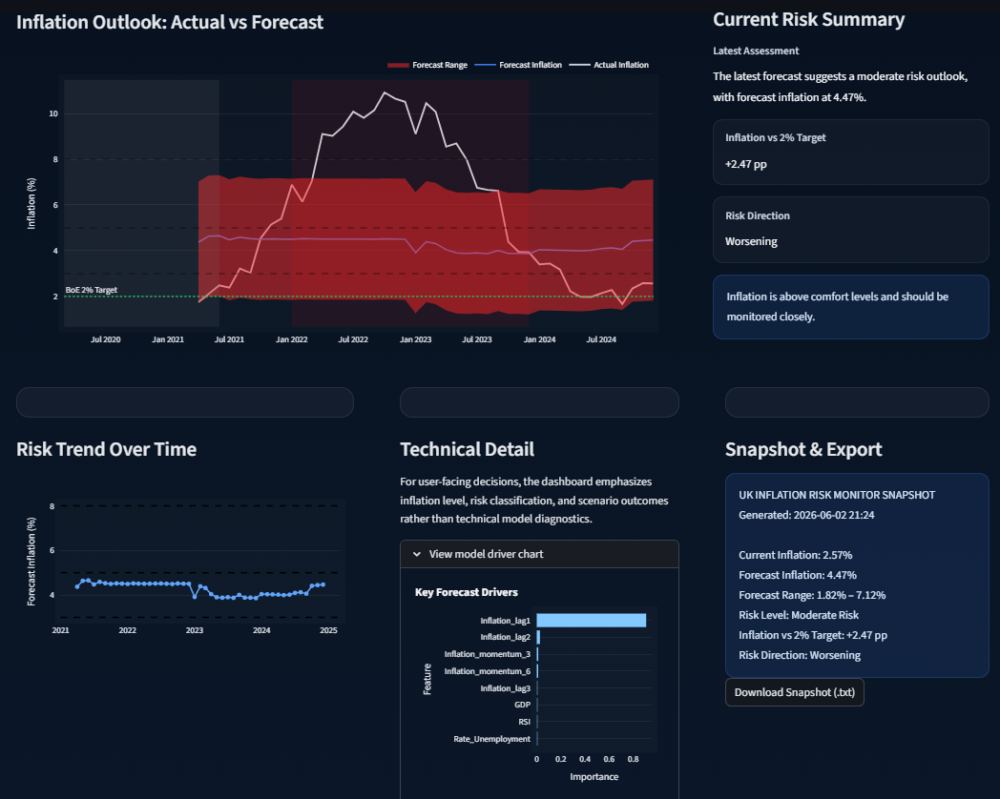
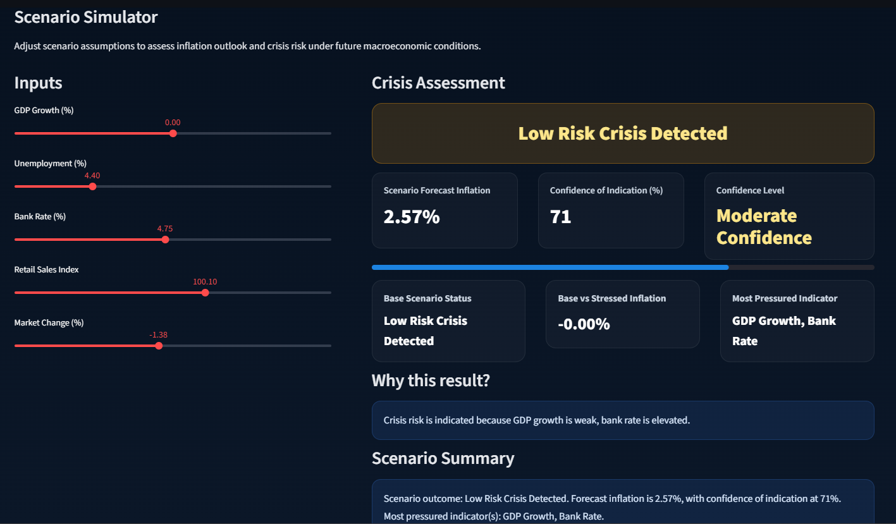
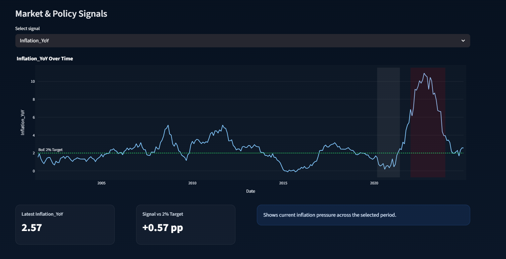
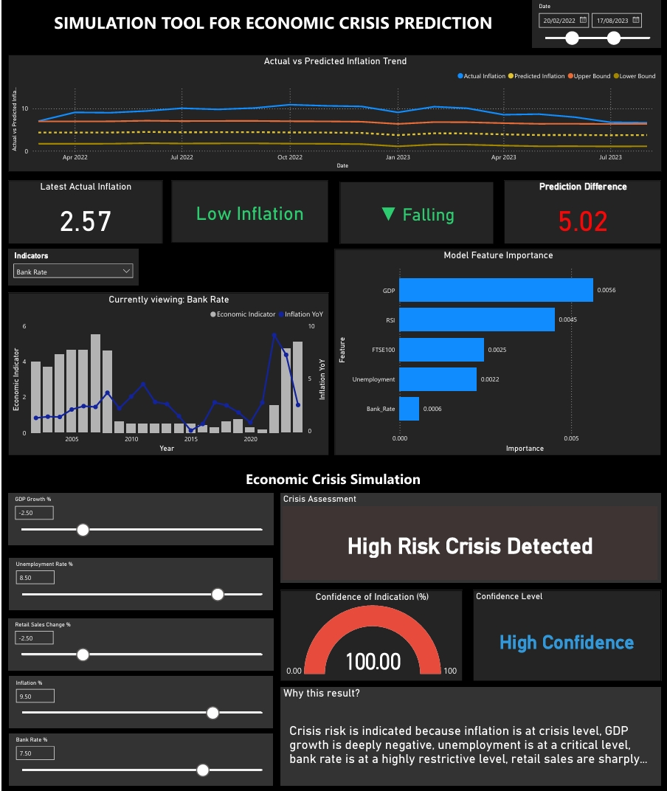

# UK Inflation Risk Monitor & Crisis Simulation Tool

## Overview

This project was developed as part of my MSc Artificial Intelligence for Business Intelligence dissertation at the University of Leicester.

The objective of the project is to forecast UK inflation and identify potential economic crisis conditions using machine learning models and macroeconomic indicators.

The system combines economic forecasting, crisis risk assessment, and interactive scenario simulation into a user-friendly dashboard built with Streamlit.

---

## Problem Statement

Inflation forecasting remains a significant challenge due to changing economic conditions, policy interventions, and external shocks.

Traditional forecasting approaches often struggle to capture complex interactions between macroeconomic variables.

This project investigates whether machine learning techniques can improve inflation forecasting performance while providing decision-makers with an interactive economic monitoring tool.

---

## Data Sources

* Office for National Statistics (ONS)
* Bank of England
* Yahoo Finance

### Macroeconomic Variables

* GDP Growth
* Unemployment Rate
* Bank Rate
* FTSE 100
* Retail Sales Index (RSI)

---

## Models Implemented

### ARIMA

Traditional statistical time-series forecasting model used as a baseline.

### Random Forest

Ensemble machine learning model used for inflation prediction.

### XGBoost

Gradient boosting model used for comparative performance evaluation.

---

## Model Performance

| Model         | RMSE |
| ------------- | ---- |
| ARIMA         | 3.88 |
| Random Forest | 2.65 |
| XGBoost       | 2.77 |

Random Forest achieved the best overall forecasting performance and was selected as the final deployment model.

---

## Dashboard Features

* Inflation Forecasting
* Crisis Risk Monitoring
* Scenario Simulation
* Future Economic Assumption Upload
* Confidence Intervals
* Market & Policy Signal Analysis

---

## Dashboard Preview

### Dashboard Overview

### Executive Overview

### Scenario Simulator

### Market & Policy Signals

---

## Dashboard Evolution

The project initially explored Power BI for visualization and reporting. As the scope expanded to include scenario simulation, user-driven forecasting and future data uploads, the implementation was migrated to Streamlit for greater flexibility and interactivity.

### Initial Power BI Prototype

## Technologies Used

* Python
* Streamlit
* Pandas
* NumPy
* Plotly
* Scikit-Learn
* XGBoost
* Statsmodels

---

## Dissertation

The complete MSc dissertation report is included within the repository.

Location:

reports/249055658_Final_Dissertation.pdf

---

## Author

Pratiksha T.
MSc Artificial Intelligence for Business Intelligence
University of Leicester
